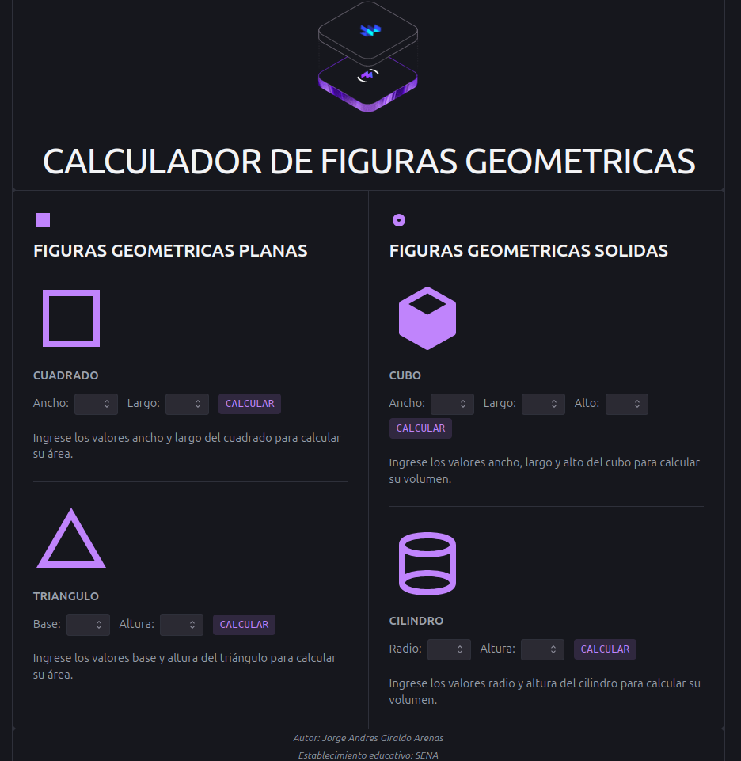
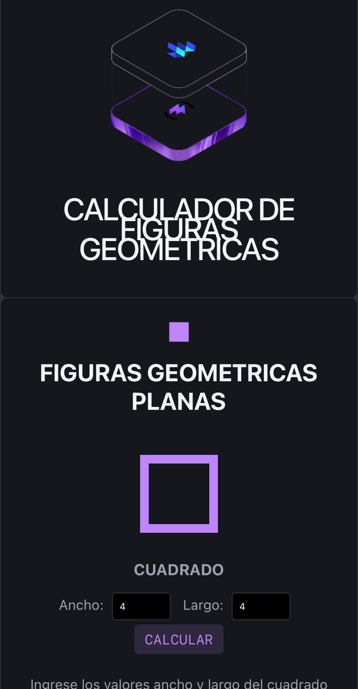
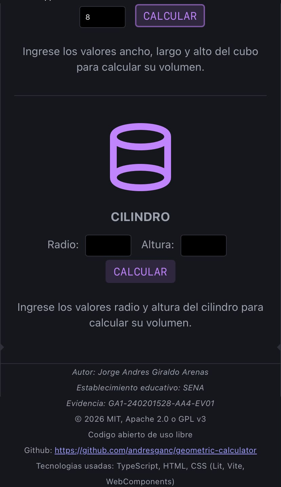
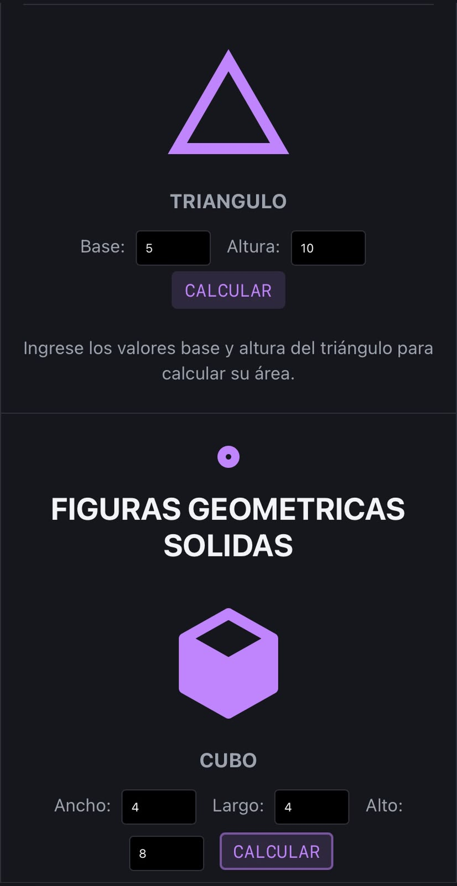

# GEOMETRIC CALCULATOR

- 

## LINK USE

- lINK: https://nc-container.s3.us-east-1.amazonaws.com/geometric-calculator/index.html

 

### WEB GEOMETRIC CALCULATOR

- Web project developed with technologies: HTML, CSS, Typescript, (Lit, WebComponents, Vite)

 

### Responsive desktop version.

 

### Responsive mobile version.

 

## DESKTOP GEOMETRIC CALCULATOR